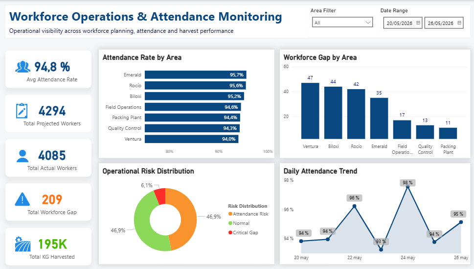
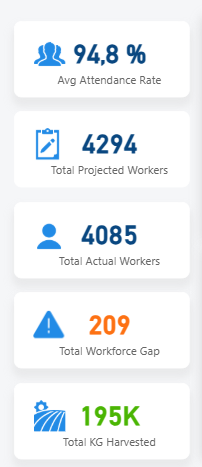
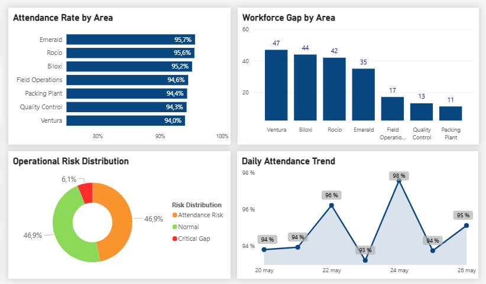
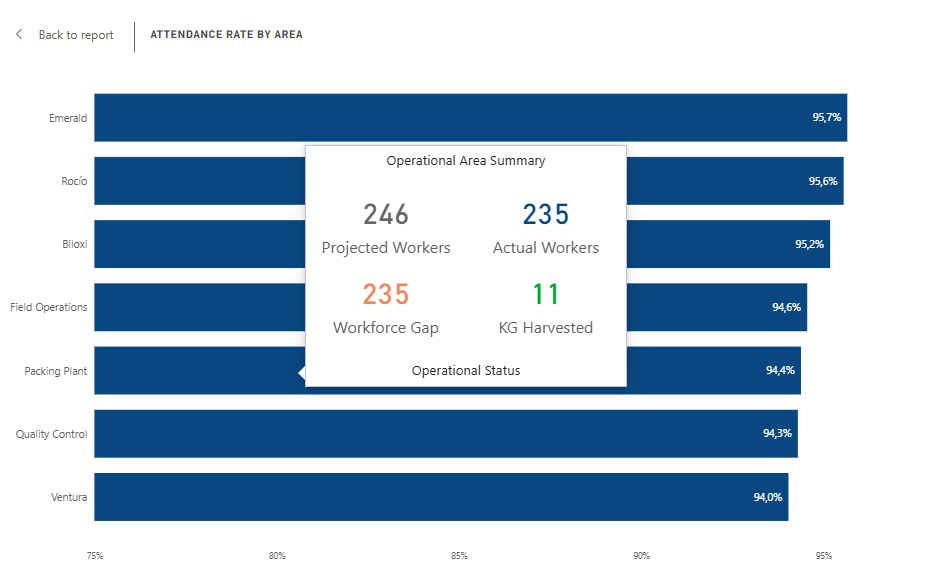

# Operational Workforce Data Pipeline


An end-to-end workforce operations analytics project focused on attendance monitoring, workforce planning, operational risk detection, and harvest performance analysis.

This project simulates a real-world operational reporting workflow by combining Python-based ETL processing with Power BI dashboard visualization.

---

# Project Overview

The pipeline processes operational workforce data through multiple stages:

- Data generation
- Data consolidation
- Validation and anomaly detection
- Final KPI dataset creation
- Business intelligence visualization

The final result is an executive-style operations dashboard designed for workforce monitoring and operational decision-making.

---

# Business Problem

Operational teams require visibility into workforce attendance, labor gaps, harvest productivity, and operational risks in order to support planning and field execution.

This project demonstrates how automated data pipelines and reporting workflows can improve operational visibility and decision-making.

---

# Tech Stack

- Python
- pandas
- SQL concepts
- Power BI
- Power Query
- Git & GitHub
- VS Code

---

# Project Structure

```bash
operational-workforce-data-pipeline/
│
├── data/
│   ├── raw/
│   ├── processed/
│   └── final/
│
├── scripts/
│   ├── generate_sample_data.py
│   ├── consolidate_workforce_data.py
│   ├── validate_workforce_data.py
│   └── build_final_dataset.py
│
├── dashboard/
├── images/
├── reports/
└── README.md
```

---

# Dashboard Preview

## Main Dashboard



---

## KPI Section



---

## Charts Section



---

## Dynamic Tooltip



---

# Key Features

- Workforce attendance monitoring
- Workforce gap analysis
- Operational risk classification
- Harvest productivity tracking
- Dynamic tooltip drill-through insights
- Multi-stage ETL workflow
- Automated KPI generation

---

# Data Validation Rules

The validation process includes:

- Attendance alert detection
- Critical workforce gap identification
- KPI consistency validation
- Operational status classification

---

# Power BI Dashboard

The dashboard includes:

- KPI cards
- Workforce trend analysis
- Attendance monitoring
- Operational risk distribution
- Interactive slicers
- Dynamic tooltips

---

# Key Technical & Business Learning Outcomes

During the development of this project, multiple technical and operational concepts were applied in a business-oriented workflow environment.

Key areas developed throughout the project include:

- ETL pipeline structuring using Python and pandas
- Multi-stage operational data processing
- Data validation and anomaly detection workflows
- KPI engineering for operational decision-making
- Dashboard design focused on executive visibility
- Interactive Power BI reporting and tooltip design
- Git and GitHub workflow fundamentals
- File structure organization for analytics projects
- Troubleshooting regional settings and decimal parsing issues in Power BI
- Business-oriented operational storytelling through data visualization

This project was designed as a practical transition step toward Data Engineering, Analytics Engineering, and Automation-focused roles.

---

# Future Improvements

- SQL database integration
- Automated scheduled refresh
- API ingestion
- Cloud deployment
- Advanced pipeline orchestration

---

# Author

Andrea Meroussis

Automation & Data Operations Analyst  
Building toward Data Engineering